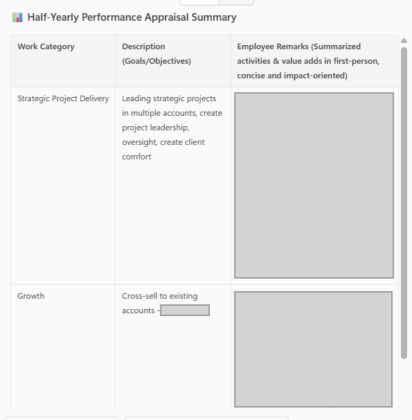

# 🚀 Annual Appraisal Data Extractor Prompt 💻

## Summary

Generates appraisal-ready employee remarks by summarizing key activities and value adds across defined work categories.

## Prompt 💡

I need to prepare inputs for my [annual] performance appraisal. Please analyze my emails, Teams chats, and files from [Start Date] to [End date].

From this data, identify and summarize the key activities, contributions, and value additions I have made that align with the goals/objectives of the categories below.

Present the output in a tabular format with the following columns:

Work Category, Description (Goals/Objectives), Employee Remarks (Summarized activities & value adds in first-person, concise and impact-oriented)

Here are the work categories:

Sample Work Category 1: [Strategic Project Delivery]
Description: [Insert goals/objectives details]
Employee Remarks: [To be generated]

Sample Work Category 2: [Growth]
Description: [Insert goals/objectives details]
Employee Remarks: [To be generated]

Sample Work Category 3: People
Description: [Insert goals/objectives details]
Employee Remarks: [To be generated].

## Description ℹ️

This prompt helps generate annual appraisal inputs by analyzing emails, Teams chats, and files within a defined date range. It extracts key activities, contributions, and value additions mapped to specific work categories (Strategic Project Delivery, Growth, People, etc,) and organizes them into a tabular format. The output provides ready-to-use employee remarks, written in a positive, outcome-driven, and first-person style, making it easier to complete performance review sections.

## Contributors 👨‍💻

[Saurabh Agrawal](https://github.com/sharepointsaurabh)

## Version history

Version|Date|Comments
-------|----|--------
1.0|August 27, 2025|Initial release

## Instructions 📝

1. Make sure you have copilot for Microsoft 365 in your tenant
2. Go to Microsoft 365 Copilot in Office.com or use Copilot chat in Teams
3. Copy paste the above prompt and replace the text in [] as per your requirements
4. Copilot will start extracting data

## Prerequisites

* [Copilot for Microsoft 365](https://developer.microsoft.com/microsoft-365/dev-program)

## Help

We do not support samples, but this community is always willing to help, and we want to improve these samples. We use GitHub to track issues, which makes it easy for  community members to volunteer their time and help resolve issues.

You can try looking at [issues related to this sample](https://github.com/pnp/copilot-prompts/issues?q=label%3A%22sample%3A%20YOUR-SAMPLE-NAME%22) to see if anybody else is having the same issues.

If you encounter any issues using this sample, [create a new issue](https://github.com/pnp/copilot-prompts/issues/new).

Finally, if you have an idea for improvement, [make a suggestion](https://github.com/pnp/copilot-prompts/issues/new).

## Disclaimer

**THIS CODE IS PROVIDED *AS IS* WITHOUT WARRANTY OF ANY KIND, EITHER EXPRESS OR IMPLIED, INCLUDING ANY IMPLIED WARRANTIES OF FITNESS FOR A PARTICULAR PURPOSE, MERCHANTABILITY, OR NON-INFRINGEMENT.**

