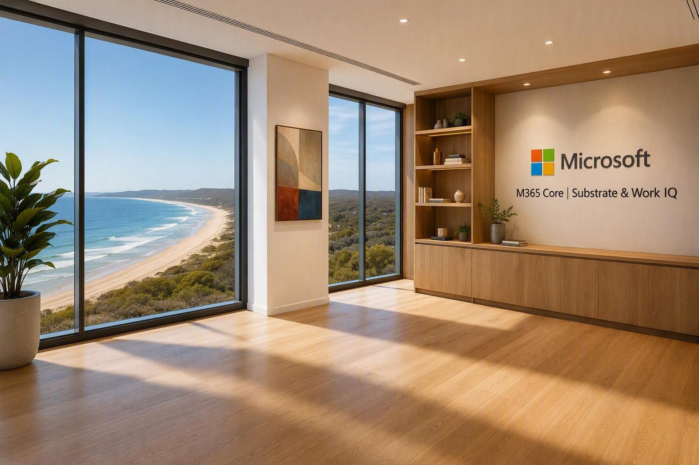

# M365 Core Teams Virtual Background

## Summary

Creates a polished Microsoft Teams virtual background featuring a bright West Seattle executive office with Microsoft branding and a sleeping dog.

## Prompt 💡

Photorealistic Microsoft Teams virtual background, bright contemporary executive office in West Seattle, Washington, floor-to-ceiling windows with views over the Cascades, view of Mt Rainier in the background, abundant natural daylight, oak timber shelves, airy modern interior, 20th century artwork on the walls, illuminated modern wall signage with a high-contrast lettering reading "M365 Core | Substrate & Work IQ" with the Microsoft logo, professional executive workspace, realistic depth of field, ultra high resolution, welcoming, bright, sophisticated, suitable for video calls. Do not include a desk or chair in the foreground. Include a dog to the side on the floor curled up asleep. This is the dog.

## Description ℹ️

This prompt generates a photorealistic, professional Microsoft Teams background set in a bright contemporary executive office in West Seattle. It combines Pacific Northwest scenery, modern oak finishes, Microsoft branding, and a relaxed sleeping dog to create a welcoming setting suitable for video calls.

## Contributors 👨‍💻

[Anthony Shaw](https://github.com/tonybaloney)

## Version history

Version|Date|Comments
-------|----|--------
1.0|September 1, 2026|Initial release

## Instructions 📝

1. Open Microsoft 365 Copilot and start a new chat.
2. Attach a reference image of the dog you want included in the background.
3. Copy and paste the prompt into the chat, then generate the image.
4. Download the generated image and add it as a custom background in Microsoft Teams.

### Improvise Usage 🚀

Adjust the location, scenery, artwork, lighting, signage, or interior finishes to create a virtual background tailored to your organization or team.

## Prerequisites

* [Copilot for Microsoft 365](https://developer.microsoft.com/microsoft-365/dev-program)

## Help

We do not support samples, but this community is always willing to help, and we want to improve these samples. We use GitHub to track issues, which makes it easy for community members to volunteer their time and help resolve issues.

You can try looking at [issues related to this sample](https://github.com/pnp/copilot-prompts/issues?q=label%3A%22sample%3A%20m365-core-teams-virtual-background-prompt%22) to see if anybody else is having the same issues.

If you encounter any issues using this sample, [create a new issue](https://github.com/pnp/copilot-prompts/issues/new).

Finally, if you have an idea for improvement, [make a suggestion](https://github.com/pnp/copilot-prompts/issues/new).

## Disclaimer

**THIS CODE IS PROVIDED *AS IS* WITHOUT WARRANTY OF ANY KIND, EITHER EXPRESS OR IMPLIED, INCLUDING ANY IMPLIED WARRANTIES OF FITNESS FOR A PARTICULAR PURPOSE, MERCHANTABILITY, OR NON-INFRINGEMENT.**

---

