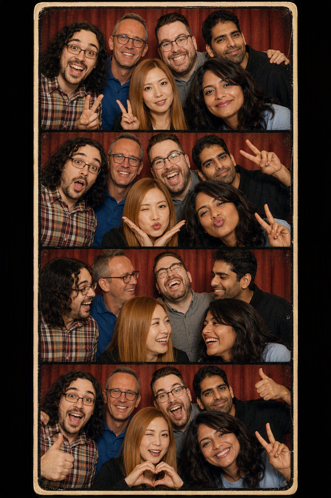

# Photo Booth Skill for Microsoft 365 Copilot

> [!NOTE]
> The image shown above was created using the skill.
>
> **Prompt:** "Create fun retro style photobooth strip using the skill. Use these people but create photobooth strip with everyone together in each pic as work friends out on a fun day. "

> [!WARNING]
> **Share responsibly:** Always obtain consent from every identifiable person before posting or sharing their photo or an AI-generated image of them. Consider privacy and security implications, including exposed personal information, locations, and image metadata. Do not publish inappropriate, harmful, misleading, or non-consensual AI-generated images. Review every image carefully and use good judgment before sharing it.

> [!IMPORTANT]
> Custom skills in Declarative Agents are currently available in preview through the Microsoft Frontier Program, with general availability planned soon. Your organization must be enrolled in the Frontier Program to try this skill in Agent Builder today.

## Summary

Create a photorealistic 3x3 photo-booth grid from reference images while keeping the people, wardrobe, setting, lighting, and framing visually consistent across all nine panels.

## Skill

The full skill definition is in [SKILL.md](./SKILL.md). Package it as a ZIP file with `SKILL.md` at the archive root, then upload the package to a Declarative Agent in Microsoft 365 Copilot Agent Builder.

### Trigger Phrases

Say any of these to Microsoft 365 Copilot to activate the skill:

- "Create a photo-booth grid from these images"
- "Make a 3x3 couple selfie grid"
- "Generate an emotion grid with the same people"
- "Create synchronized portrait variations from these references"

## Description

This skill analyzes supplied reference images, defines a continuity lock for the people and photographic treatment, plans nine synchronized expressions or micro-poses, and generates a single square 3x3 master image. It then reviews the result for consistent identities, wardrobe, backdrop, lighting, framing, and face visibility.

The skill requires a primary reference image. A partner reference is optional; when one is not supplied, the user can describe a fictional or generic partner concept instead.

## Contributors

[Abram Jackson](https://www.linkedin.com/in/abramj/)

## Version history

Version|Date|Comments
-------|----|--------
1.0|September 11, 2026|Initial release

## Instructions

1. Download [SKILL.md](./SKILL.md) 
2. Compress `SKILL.md` into `photo-booth.zip`, ensuring `SKILL.md` is at the root of the archive and not inside a nested folder
3. Open [Microsoft 365 Copilot Chat](https://m365.cloud.microsoft/chat) and sign in
4. Under **Agents**, select **+ New agent**, then select **Skip** to open the configuration experience
5. Configure your Agent with name, description and instruction (keep it simple one liner), expand **Skills**, select **Add**, and upload `photo-booth.zip`
6. Create and publish the agent using the audience permitted by your organization
7. Open the agent, attach a primary reference image and, optionally, a partner reference image
8. Say: *"Create a photo-booth grid from these images"*

For a complete walkthrough of packaging, uploading, publishing, and testing a custom skill, follow [Lab E12 - Build Agent with Skill using Agent Builder](https://microsoft.github.io/copilot-camp/pages/extend-m365-copilot/12-skills-da-agent-builder/).

### Customization

- Adjust the default photographic treatment for a specific era like 80s, futuristic tec
- Add stricter continuity anchors for recurring characters, accessories, or branded environments

## Prerequisites

- A Microsoft 365 account with a qualifying [Microsoft 365 Copilot](https://www.microsoft.com/microsoft-365/copilot) license or pay-as-you-go access
- An organization enrolled in the Microsoft Frontier Program while custom skills remain in preview
- Permission to create Declarative Agents in your tenant
- Access to image generation in Microsoft 365 Copilot

## Help

We do not support samples, but this community is always willing to help, and we want to improve these samples. We use GitHub to track issues, which makes it easy for community members to volunteer their time and help resolve issues.

You can try looking at [issues related to this sample](https://github.com/pnp/copilot-prompts/issues?q=label%3A%22sample%3A%20photo-booth%22) to see if anybody else is having the same issues.

If you encounter any issues using this sample, [create a new issue](https://github.com/pnp/copilot-prompts/issues/new).

Finally, if you have an idea for improvement, [make a suggestion](https://github.com/pnp/copilot-prompts/issues/new).

## Disclaimer

**THIS CODE IS PROVIDED *AS IS* WITHOUT WARRANTY OF ANY KIND, EITHER EXPRESS OR IMPLIED, INCLUDING ANY IMPLIED WARRANTIES OF FITNESS FOR A PARTICULAR PURPOSE, MERCHANTABILITY, OR NON-INFRINGEMENT.**

